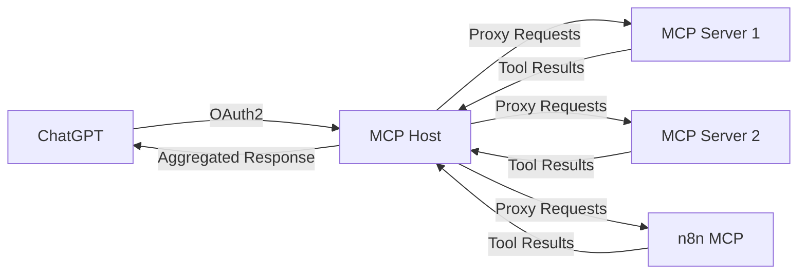

# ChatGPT Integration Guide

This guide explains how to connect your MCP Host to ChatGPT using OpenAI's custom connector feature. This allows ChatGPT to access your MCP servers and tools through the standardized Model Context Protocol.

## 📋 Table of Contents

1. [Overview](#overview)
2. [Prerequisites](#prerequisites)
3. [Setting Up OAuth2](#setting-up-oauth2)
4. [Configuring MCP Host](#configuring-mcp-host)
5. [Creating ChatGPT Custom Connector](#creating-chatgpt-custom-connector)
6. [Testing the Integration](#testing-the-integration)
7. [Adding MCP Servers](#adding-mcp-servers)
8. [Troubleshooting](#troubleshooting)
9. [Best Practices](#best-practices)

## 🎯 Overview

The integration works through the following flow:

1. **Authentication**: ChatGPT authenticates with your MCP Host using OAuth2
2. **Discovery**: ChatGPT discovers available tools and resources from your MCP servers
3. **Tool Execution**: ChatGPT can call tools and access resources through your MCP Host
4. **Response**: Results are returned to ChatGPT for use in conversations



## ✅ Prerequisites

Before setting up the integration, ensure you have:

- [ ] MCP Host deployed and accessible via HTTPS
- [ ] Valid SSL certificate (required for ChatGPT)
- [ ] ChatGPT Pro or Enterprise account
- [ ] Access to ChatGPT custom connectors feature
- [ ] At least one MCP server configured in your MCP Host

## 🔐 Setting Up OAuth2

### 1. Generate OAuth2 Credentials

Currently, OpenAI's custom connector OAuth2 implementation is in beta. For now, MCP Host provides a simplified OAuth2 flow:

```bash
# Generate a random client ID and secret
export OAUTH_CLIENT_ID=$(openssl rand -hex 16)
export OAUTH_CLIENT_SECRET=$(openssl rand -hex 32)

echo "Client ID: $OAUTH_CLIENT_ID"
echo "Client Secret: $OAUTH_CLIENT_SECRET"
```

### 2. Configure OAuth2 Environment Variables

Add these to your MCP Host environment:

```bash
# OAuth2 Configuration
OAUTH_CLIENT_ID=your-generated-client-id
OAUTH_CLIENT_SECRET=your-generated-client-secret
OAUTH_REDIRECT_URI=https://your-domain.com/auth/callback
OAUTH_SCOPE=mcp:read mcp:write

# Ensure HTTPS is enforced
CORS_ORIGINS=https://chat.openai.com,https://chatgpt.com
```

### 3. Verify OAuth2 Endpoints

Test that your OAuth2 endpoints are working:

```bash
# Check OAuth2 metadata
curl https://your-domain.com/.well-known/oauth-authorization-server

# Expected response:
{
  "issuer": "https://your-domain.com",
  "authorization_endpoint": "https://your-domain.com/auth/authorize",
  "token_endpoint": "https://your-domain.com/auth/token",
  "response_types_supported": ["code"],
  "grant_types_supported": ["authorization_code", "refresh_token"],
  "scopes_supported": ["mcp:read", "mcp:write"]
}
```

## ⚙️ Configuring MCP Host

### 1. Update Environment Configuration

Ensure your `.env` file includes:

```bash
# Production settings
ENVIRONMENT=production
DEBUG=false
HOST=0.0.0.0
PORT=8000

# Security
SECRET_KEY=your-secure-secret-key-32-chars-minimum

# OAuth2 for ChatGPT
OAUTH_CLIENT_ID=your-client-id
OAUTH_CLIENT_SECRET=your-client-secret
OAUTH_REDIRECT_URI=https://your-domain.com/auth/callback

# CORS for ChatGPT
CORS_ORIGINS=https://chat.openai.com,https://chatgpt.com

# MCP Protocol
MAX_CONCURRENT_SERVERS=10
SERVER_TIMEOUT=30
```

### 2. Deploy Configuration

**Docker Compose:**
```bash
docker-compose down
docker-compose up -d
```

**Coolify:**
- Update environment variables in Coolify dashboard
- Redeploy the application

### 3. Test MCP Endpoints

Verify your MCP endpoints are accessible:

```bash
# Test SSE endpoint (primary for ChatGPT)
curl -H "Accept: text/event-stream" https://your-domain.com/sse

# Test MCP JSON-RPC endpoint
curl -X POST https://your-domain.com/mcp \
  -H "Content-Type: application/json" \
  -d '{
    "jsonrpc": "2.0",
    "id": 1,
    "method": "initialize",
    "params": {
      "protocolVersion": "2024-11-05",
      "capabilities": {}
    }
  }'
```

## 🔗 Creating ChatGPT Custom Connector

### 1. Access Custom Connectors

1. Open ChatGPT (Pro/Enterprise account required)
2. Click on your profile → Settings
3. Navigate to "Features" → "Custom Connectors"
4. Click "Create New Connector"

### 2. Basic Configuration

Fill in the connector details:

```json
{
  "name": "My MCP Host",
  "description": "Connect to my MCP servers for automation and data access",
  "icon": "🔗"
}
```

### 3. MCP Server Configuration

**MCP Server URL:**
```
https://your-domain.com/sse
```

**Authentication Type:**
```
OAuth 2.0
```

**OAuth Configuration:**
```json
{
  "client_id": "your-oauth-client-id",
  "authorization_url": "https://your-domain.com/auth/authorize",
  "token_url": "https://your-domain.com/auth/token",
  "scope": "mcp:read mcp:write"
}
```

### 4. Trust and Enable

1. Check "I trust this application"
   > ⚠️ **Security Note**: Only check this for your own MCP Host instance
2. Click "Create Connector"
3. Enable the connector

## 🧪 Testing the Integration

### 1. Authorize Connection

1. In ChatGPT, try using your connector
2. You'll be redirected to your MCP Host for authorization
3. Approve the connection
4. You should be redirected back to ChatGPT

### 2. Test Basic Functionality

Try these prompts in ChatGPT:

**Discover Tools:**
```
What tools and capabilities do you have access to through my MCP Host?
```

**List Available Resources:**
```
Show me what resources are available through my MCP servers.
```

**Test n8n Integration (if configured):**
```
What n8n workflows can you help me with?
```

### 3. Verify in MCP Host Dashboard

1. Go to your MCP Host web interface
2. Check "Sessions" tab
3. You should see an active ChatGPT session
4. Monitor "Activity" for tool calls and requests

## 📦 Adding MCP Servers

To make your ChatGPT connector useful, you need MCP servers. Here are some examples:

### 1. n8n Workflow Automation

```bash
curl -X POST https://your-domain.com/api/v1/servers \
  -H "Authorization: Bearer your-api-key" \
  -H "Content-Type: application/json" \
  -d '{
    "name": "n8n-automation",
    "description": "n8n workflow automation and node documentation",
    "command": "npx",
    "args": ["@n8n-mcp/server"],
    "env": {
      "N8N_API_URL": "https://your-n8n-instance.com",
      "N8N_API_KEY": "your-n8n-api-key"
    },
    "transport_type": "stdio",
    "auto_restart": true
  }'
```

### 2. GitHub Integration

```bash
curl -X POST https://your-domain.com/api/v1/servers/from-github \
  -H "Authorization: Bearer your-api-key" \
  -H "Content-Type: application/json" \
  -d '{
    "github_url": "https://github.com/modelcontextprotocol/servers",
    "name": "mcp-official-servers"
  }'
```

### 3. Custom Business Tools

```bash
curl -X POST https://your-domain.com/api/v1/servers \
  -H "Authorization: Bearer your-api-key" \
  -H "Content-Type: application/json" \
  -d '{
    "name": "business-tools",
    "description": "Custom business automation tools",
    "command": "python",
    "args": ["business_tools_server.py"],
    "env": {
      "CRM_API_KEY": "your-crm-key",
      "DATABASE_URL": "your-db-url"
    },
    "transport_type": "stdio"
  }'
```

## 🔧 Troubleshooting

### Common Issues

**1. OAuth2 Authorization Failed**

Check your OAuth2 configuration:
```bash
# Verify endpoints are accessible
curl https://your-domain.com/.well-known/oauth-authorization-server

# Check CORS settings
CORS_ORIGINS=https://chat.openai.com,https://chatgpt.com

# Verify SSL certificate
openssl s_client -connect your-domain.com:443
```

**2. "Failed to Connect" Error**

This usually indicates SSL or connectivity issues:
```bash
# Test from ChatGPT's perspective
curl -H "Accept: text/event-stream" https://your-domain.com/sse

# Check SSL certificate validity
curl -I https://your-domain.com/health

# Verify no proxy/firewall blocks
```

**3. "No Tools Available" Message**

This means no MCP servers are running:
```bash
# Check server status
curl https://your-domain.com/api/v1/servers

# Start servers if needed
curl -X POST https://your-domain.com/api/v1/servers/1/start
```

**4. Tools Don't Work**

Check individual server health:
```bash
# Test server health
curl https://your-domain.com/api/v1/servers/1/health

# Check server logs
docker-compose logs backend

# Test MCP protocol directly
curl -X POST https://your-domain.com/mcp \
  -H "Content-Type: application/json" \
  -d '{
    "jsonrpc": "2.0",
    "id": 1,
    "method": "tools/list"
  }'
```

### Debug Mode

Enable detailed logging:
```bash
DEBUG=true
LOG_LEVEL=DEBUG
docker-compose restart backend
```

### Test OAuth2 Flow Manually

```bash
# Step 1: Get authorization code
curl -v "https://your-domain.com/auth/authorize?client_id=your-client-id&redirect_uri=https://your-domain.com/auth/callback&response_type=code&scope=mcp:read%20mcp:write"

# Step 2: Exchange code for token
curl -X POST https://your-domain.com/auth/token \
  -H "Content-Type: application/x-www-form-urlencoded" \
  -d "grant_type=authorization_code&code=AUTH_CODE&client_id=your-client-id&redirect_uri=https://your-domain.com/auth/callback"

# Step 3: Use token to access MCP
curl -X POST https://your-domain.com/mcp \
  -H "Authorization: Bearer ACCESS_TOKEN" \
  -H "Content-Type: application/json" \
  -d '{"jsonrpc": "2.0", "id": 1, "method": "tools/list"}'
```

## 🎯 Best Practices

### Security

1. **Use HTTPS Only**: ChatGPT requires SSL/TLS
2. **Secure OAuth2 Secrets**: Store securely, rotate regularly
3. **Limit CORS Origins**: Only allow ChatGPT domains
4. **Monitor Access**: Review session logs regularly
5. **Rate Limiting**: Enable to prevent abuse

### Performance

1. **Optimize MCP Servers**: Ensure fast response times
2. **Monitor Resource Usage**: Watch for memory/CPU spikes
3. **Cache Responses**: Cache static tool/resource lists
4. **Scale Horizontally**: Use multiple backend instances
5. **Health Checks**: Implement comprehensive monitoring

### User Experience

1. **Clear Tool Names**: Use descriptive tool names and descriptions
2. **Error Handling**: Provide clear error messages
3. **Documentation**: Document available tools and usage
4. **Response Format**: Structure tool responses clearly
5. **Feedback Loop**: Monitor and improve based on usage

### Configuration

```bash
# Recommended production settings
ENVIRONMENT=production
DEBUG=false
LOG_LEVEL=INFO

# Performance settings
MAX_CONCURRENT_SERVERS=20
SERVER_TIMEOUT=30
CONNECTION_POOL_SIZE=50
RATE_LIMIT_PER_MINUTE=100

# Security settings
ACCESS_TOKEN_EXPIRE_MINUTES=60
REFRESH_TOKEN_EXPIRE_DAYS=30
```

## 📚 Example Use Cases

### 1. Workflow Automation with n8n

**ChatGPT Prompt:**
```
"Create a workflow that monitors my email for support tickets and automatically creates Jira issues"
```

**Available through MCP:**
- n8n workflow creation and management
- Email integration tools
- Jira API access
- Notification systems

### 2. Business Intelligence

**ChatGPT Prompt:**
```
"Show me last month's sales data and create a summary report"
```

**Available through MCP:**
- Database query tools
- Report generation utilities
- Chart/visualization tools
- Email/Slack notification tools

### 3. Development Assistance

**ChatGPT Prompt:**
```
"Help me deploy the latest version of my app and run tests"
```

**Available through MCP:**
- Git repository tools
- CI/CD pipeline triggers
- Testing framework integration
- Deployment automation tools

## 🔄 Updating and Maintenance

### Regular Updates

1. **Keep MCP Host Updated**: Monitor for security updates
2. **Update MCP Servers**: Keep server dependencies current
3. **Rotate OAuth2 Secrets**: Periodically refresh credentials
4. **Monitor Logs**: Watch for unusual activity or errors
5. **Backup Configuration**: Maintain backups of working configs

### Monitoring Dashboard

Set up monitoring for:
- OAuth2 authentication success rate
- MCP server health and response times
- Tool usage statistics
- Error rates and types
- Resource utilization

---

For more detailed information, see:
- [Main Documentation](README.md)
- [Deployment Guide](DEPLOYMENT.md)
- [API Reference](API.md)
- [Troubleshooting Guide](TROUBLESHOOTING.md)